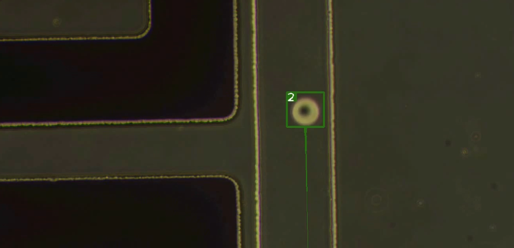

##液珠影像辨識以及排序模型
以影像處理的方式先對微流體系統進行定位，使用物件偵測模型YOLO v7辨識液珠，即時找出液珠在畫面中所在的位置，結合多目標物件追蹤系統，追蹤每一顆液珠在微流體中的移動量，程式確實能按照液珠進入畫面的順序給予編號，確保每個液珠在連續的幀中具有一致性的標籤。

##使用方法
#1.先安裝好環境，可以參考以下鏈結 : YOLOv7 實作筆記

#2.在cmd 或 Anaconda Powershell創建環境，並輸入以下指令 :

python detect_track.py --weights ".\yolov7_tracking\weights\03011_y_shape.pt" --source "你的影片路徑" 便能驅動程式，以下為實際效果 :
##實際效果
 
## 以gradcam查看效果

