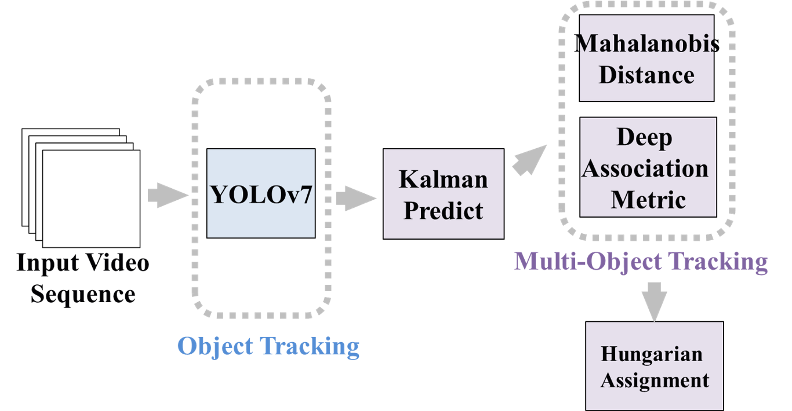
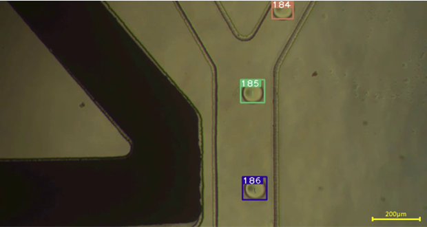
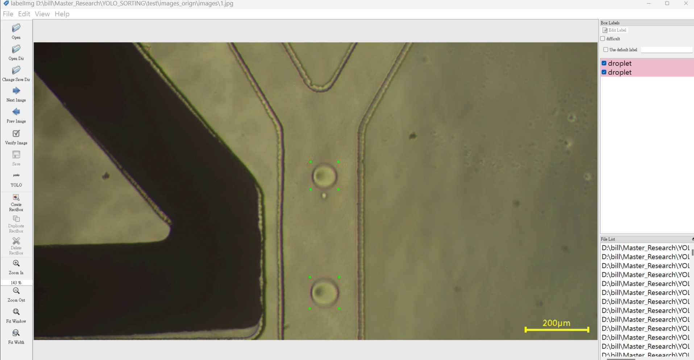

# 模型目的
在畜牧廢棄物中檢測微生物藥物耐藥性（antimicrobial resistance, AMR）對於畜牧場中病原菌管控與動物健康維護至關重要，抗藥性微生物可能源自於抗生素藥物濫用，進而影響動物健康，導致動物疾病的蔓延。計畫中使用微流體晶片、介電泳技術與AI物件檢測(object detection)技術對正常E. coli和帶有AMR E. coli作為場域應用驗證。由於AMR E. coli不受抗生素裂解細胞壁，其液珠的導電性較低，移動量較小，此模型可以在我們以影像觀測時，利用物件偵測精準辨識，並以多目標追蹤紀錄每一顆液珠的移動量

# 液珠影像辨識以及排序模型
以影像處理的方式先對微流體系統進行定位，使用物件偵測模型YOLO v7辨識液珠，即時找出液珠在畫面中所在的位置，結合多目標物件追蹤系統，追蹤每一顆液珠在微流體中的移動量，程式確實能按照液珠進入畫面的順序給予編號，確保每個液珠在連續的幀中具有一致性的標籤。

# 模型架構
由物件偵測模型YOLOv7和多目標追蹤模型組合，詳細如下圖 :

以影像處理的方式先對微流體系統進行定位，使用物件偵測模型YOLO v7辨識液珠，即時找出液珠在畫面中所在的位置，結合多目標物件追蹤系統，追蹤每一顆液珠在微流體中的移動量，程式確實能按照液珠進入畫面的順序給予編號，確保每個液珠在連續的幀中具有一致性的標籤。

# 預訓練權重
名稱:03011_y_shape.pt
由於權重過大，存取於雲端 : [預訓練權重](https://drive.google.com/file/d/171sn0465V7ZXV-WuyA9X_MXG_AQBcQcb/view?usp=drive_link)

# 使用方法
1.先安裝好環境，可以參考以下鏈結 :[YOLOv7 實作筆記](https://medium.com/@s920073ray105191/yolov7%E5%AF%A6%E4%BD%9C%E7%AD%86%E8%A8%98-c95650a98634)

2.在cmd 或 Anaconda Powershell創建環境，並輸入以下指令 :

python detect_track.py --weights ".\yolov7_tracking\weights\03011_y_shape.pt" --source "你的影片路徑" 便能驅動程式，以下為實際效果 :

# 實際效果

## 以gradcam查看效果

# 訓練資料準備
下載labelimg，對目標物以YOLO的格式進行標註，詳細參考[labelImg安裝及使用](https://hackmd.io/@osense-rd-public/H1ekDPqBt)
實際操作示意如下 :

準備至少1000張的標註影像作為訓練資料集

# 訓練方法
1.先安裝好環境
2.準備好訓練資料
3.依照類別存取，詳細參考[YOLOv7：模型訓練與推論實作

](https://hackmd.io/@franchingkao/HydtHZPlh)
4.在cmd 或 Anaconda Powershell創建環境，並輸入以下指令 :
python train.py --workers 4 --device 0 --batch-size 4 --epochs 100 --data .\data\handData.yaml --img 300 300 --cfg .\cfg\training\yolov7_hand.yaml --hyp .\data\hyp.scratch.p5.yaml --weights .\yolov7.pt
