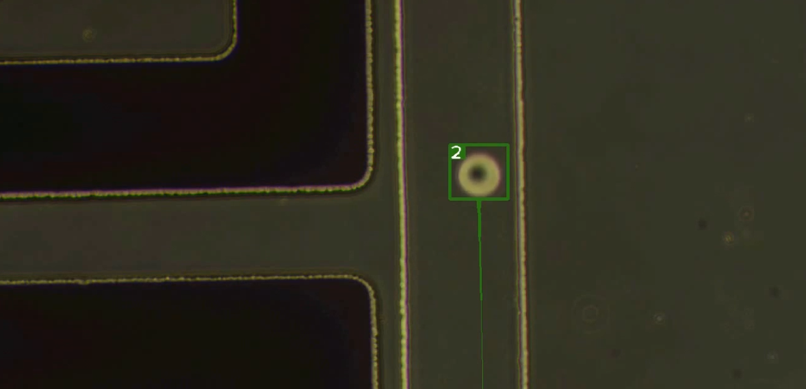

# 液珠辨識模型
## 介紹
此專案目的基於yolov7的架構，結合deep sort多目標追蹤，開發出一款微流體系統中，辨識並追蹤當中大量液珠的模型
## 功能

## 使用方法
### 在虛擬環境(Anaconda Powershell Prompt)輸入指令:
python 選用的程式名稱.py --weights "權重存放的位置" --source "辨識影片存放的位置"
##使用detect_track_trails的效果
 
